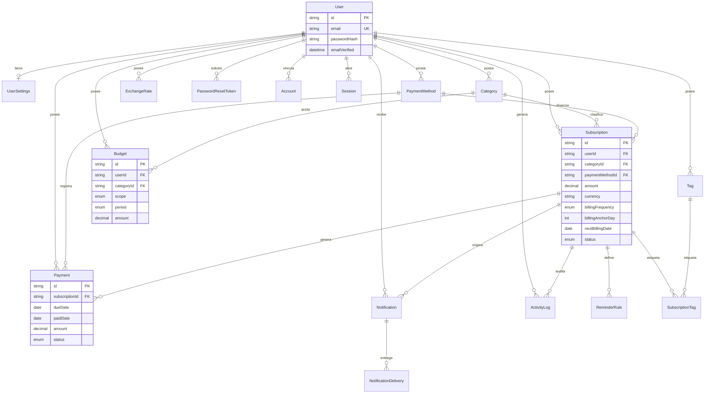

# Modelo de datos

Fuente de verdad: [`prisma/schema.prisma`](../prisma/schema.prisma). Este documento explica las entidades, relaciones y decisiones de `onDelete` — consulta el schema para los tipos y restricciones exactas.

## Diagrama de entidades

## Entidades

| Entidad | Propósito |
|---|---|
| `User` | Cuenta. `passwordHash` con argon2id. `isDemo` marca datos de ejemplo del seed. |
| `UserSettings` | Preferencias 1:1 con `User` — moneda base, idioma, zona horaria, inicio de semana, tema, preferencias de notificación, `onboardingCompletedAt`. |
| `Account` / `Session` / `VerificationToken` | Forma estándar de Auth.js, lista para añadir proveedores OAuth en el futuro. Con el proveedor Credentials actual la sesión es JWT y estas tablas no se usan activamente — ver [ARCHITECTURE.md](./ARCHITECTURE.md). |
| `PasswordResetToken` | Tokens de recuperación de un solo uso; se guarda el **hash SHA-256**, no el token en claro. |
| `Category` / `Tag` | Organización de suscripciones. Ambas son **por usuario** (no compartidas), sembradas con un set inicial útil al registrarse (`provisionNewUser`). `SubscriptionTag` es la tabla puente N:M. |
| `PaymentMethod` | Solo alias, marca, **últimos 4 dígitos**, mes/año de expiración — nunca número completo, CVV ni datos financieros sensibles. |
| `Subscription` | Entidad central. `billingAnchorDay` + `nextBillingDate` implementan la política de recurrencia — ver [RECURRENCE_RULES.md](./RECURRENCE_RULES.md). `deletedAt`/`archivedAt` para borrado lógico. |
| `ReminderRule` | Anticipaciones de aviso configurables por suscripción (`offsetDays`), por defecto `[30,7,3,1,0]`. |
| `Payment` | Historial financiero. Restricción única `(subscriptionId, dueDate)` — es la base de la idempotencia al registrar pagos. |
| `Budget` | Alcance `GLOBAL` o `CATEGORY`, período `MONTHLY`/`ANNUAL`, con umbral de alerta configurable. |
| `ExchangeRate` | Tasas manuales por usuario, con fecha (`asOfDate`) — nunca se inventan conversiones sin una tasa registrada. |
| `Notification` / `NotificationDelivery` | `dedupeKey` único en `Notification` garantiza que el job programado nunca duplique un aviso; `NotificationDelivery` registra el intento de entrega por canal. |
| `ActivityLog` | Auditoría de eventos relevantes por suscripción (creación, pago, pausa, cancelación, etc.). |

## Decisiones de `onDelete`

El principio general: **nunca destruir historial financiero silenciosamente**, y **bloquear en vez de romper** cuando borrar algo dejaría datos huérfanos que la UI no sabría explicar.

| Relación | Estrategia | Razón |
|---|---|---|
| `User → *` (todo lo propio) | `Cascade` | Al eliminar la cuenta (con confirmación reforzada), se borran todos sus datos — cumple con "eliminar mi cuenta" del perfil. |
| `Subscription → Category` | `Restrict` | Borrar una categoría en uso fallaría — la UI exige reasignar las suscripciones antes de borrar. |
| `Budget → Category` | `Cascade` | Un presupuesto por categoría no tiene sentido sin su categoría. |
| `Subscription → PaymentMethod` | `SetNull` | Borrar un método de pago es seguro: las suscripciones simplemente quedan sin método asignado (la UI avisa antes, pero no lo impide). |
| `Payment → PaymentMethod` | `SetNull` | El pago conserva su propio historial (`paymentMethodLabel` es una copia congelada del alias al momento del pago) aunque el método se borre después. |
| `Subscription → Payment` | `Cascade` | Los pagos no tienen sentido sin su suscripción; solo se eliminan si se borra la suscripción por completo (caso raro — normalmente se archiva, no se borra). |
| `Notification/ActivityLog → Subscription` | `SetNull` | El registro histórico permanece aunque la suscripción se elimine. |

## Índices relevantes

- `Subscription`: `(userId, status)`, `(userId, nextBillingDate)`, `(userId, categoryId)` — para los listados y el cálculo del panel.
- `Payment`: único `(subscriptionId, dueDate)`, más `(userId, status)` y `(userId, dueDate)`.
- `Notification`: único `dedupeKey`, más `(userId, isRead)` y `(userId, createdAt)`.
